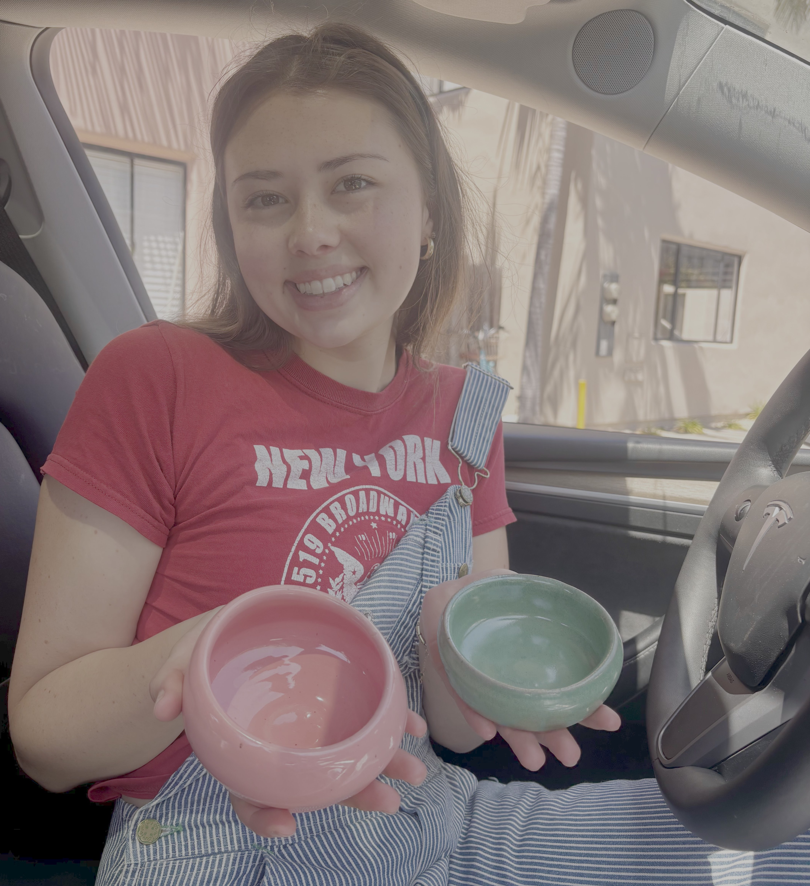
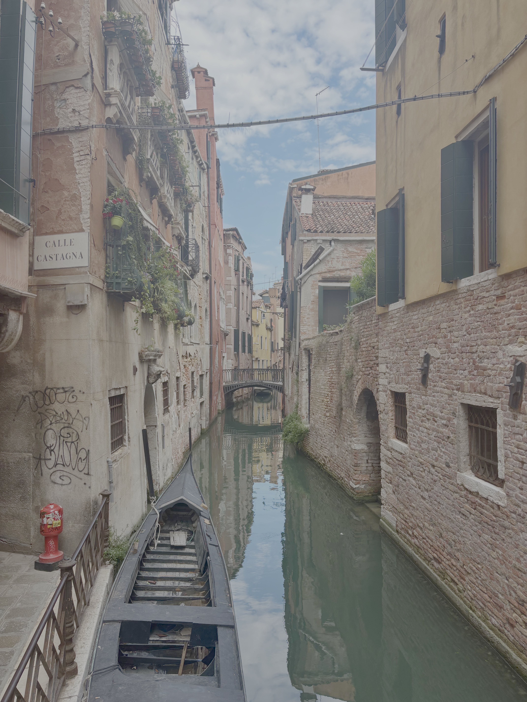
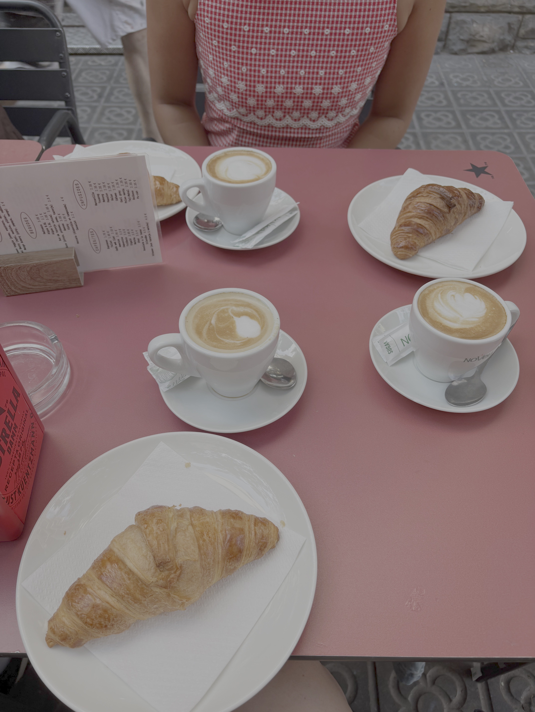
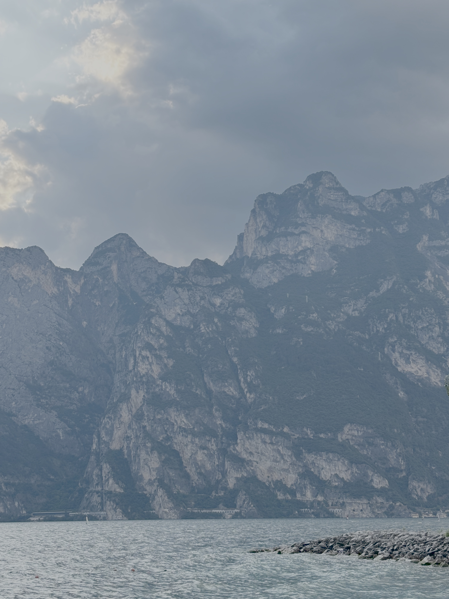

### Hobbies

I am a super crafty person! My grandma taught me to sew and crochet at a young age, and I never stopped. I make clothing items for myself from scratch, upcycle items that I thrift, and tailor clothes for my friends. I also enjoy embroidery, painting, and coloring. Check out these bowls I just made at a pottery studio in Goleta! It was my first time wheel-throwing.

{fig-alt="Me with my handmade bowls" width="800"}

### My love for tea

I am a self-proclaimed tea connoisseur. English breakfast and earl grey are my morning go-tos, and I default to matcha lattes in the afternoons. I like to experiment with making my own syrups and trying different flavor combinations. My current favorite is a passionfruit vanilla matcha latte. At any given time, chances are I'll be holding a fun drink!

### Travels

::: {layout-ncol="3"}
{alt="One of my recent loaves" fig-align="left" width="300"}

{alt="Cinnamon rolls with extra cinnamon" fig-align="center" width="300"}

{alt="Cinnamon rolls with extra cinnamon" fig-align="right" width="300"}
:::

Last summer, I was fortunate to have the opportunity to study abroad in Barcelona, Spain. I took classes in Spanish during the week and explored the region on the weekends. I especially enjoyed a trip to Venice, Italy, where I then took the train to Lake Garda. See the interactive map below for my other past destinations!

```{r}
#| label: set-up
#| message: false
#| warning: false
#| include: false
Sys.setenv(PROJ_LIB = "/opt/conda/share/proj")
```

```{r}
#| label: loading-packages
#| message: false
#| warning: false
#| include: false
library(sf)  # spatial data handling
library(raster)
library(terra)
library(leaflet) # interactive map creation       
library(htmltools) # HTML rendering for labels and popups       
library(janitor) # cleaning column names
library(tidyverse) # data manipulation and piping
library(readr)  # reading CSV files
```

```{r}
#| label: create map
#| echo: false
#| message: false
#| warning: false

# load map.csv and clean column names to lowercase
invisible(Travel <- read_csv("map.csv") %>% clean_names())

# build interactive map from travel data
leaflet(data = Travel) %>%
  addProviderTiles("Esri.WorldImagery") %>% # satellite imagery background
  
  # clickable markers that show country name in popup
  addMarkers(~long, ~lat, popup = ~country) %>%
  
  # always-visible labels below each marker
  addLabelOnlyMarkers(
    ~long, ~lat,
    label = ~country, # change ~place to ~country
    labelOptions = labelOptions(
      noHide = TRUE,  # label always visible, not just on hover
      direction = "bottom", # label sits below the marker pin
      textOnly = TRUE, # no background box, just text 
      style = list( 
        "color" = "white",  # white text for visibility on satellite map
        "font-size" = "12px", # change font size
        "font-weight" = "bold"))) # bold text for clarity
```
