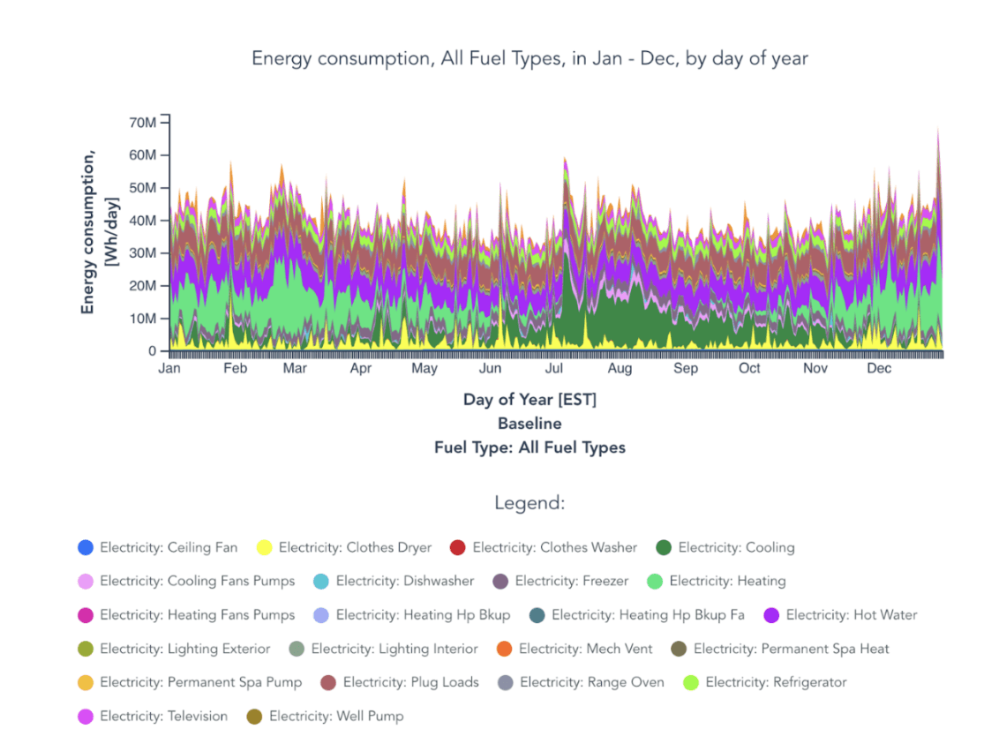

{width=100, height=100, fig-align="center"}

In January 2026, I began interning as as a Programs Associate at the Clean Coalition. My work includes conducting site-specific Solar Microgrid Feasibility Studies and collaborating with a variety of organizations to accelerate the transition to renewable energy. 

My first blog post ["How to Generate Load Profiles with ResStock and ComStock"](https://clean-coalition.org/news/how-to-generate-load-profiles-using-resstock-and-comstock/) describes the process of using the residential and commercial building model databases, ResStock and ComStock, to complete the Load Profiles portion of the Clean Coalition's Solar Microgrid Methodology (SMM). 

