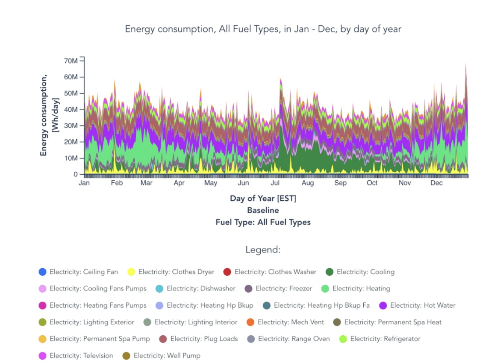

Although my bike ride home from campus is always the same length, sometimes it feels much longer. I wanted to test if that was true or if I was perceiving the difference in duration. 

Predictor variable: if I have plans after class (yes or no)
Response variable: duration of bike ride home from bike racks, in seconds
I think that if I do have plans after class, I will bike home faster. 
I also recorded the following variables: 
- temperature - I may bike home faster if I’m cold
- wind speed - if there are strong winds working against me, I will bike slower
- bike lane traffic level - low traffic would have no effect on the duration, but high traffic would slow me down
- stoplight - how many seconds I stop at the stoplight for

