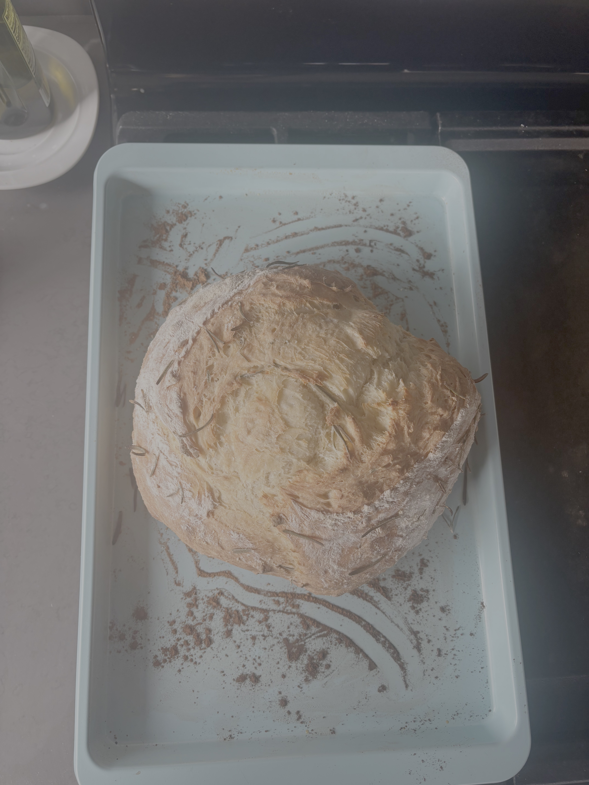
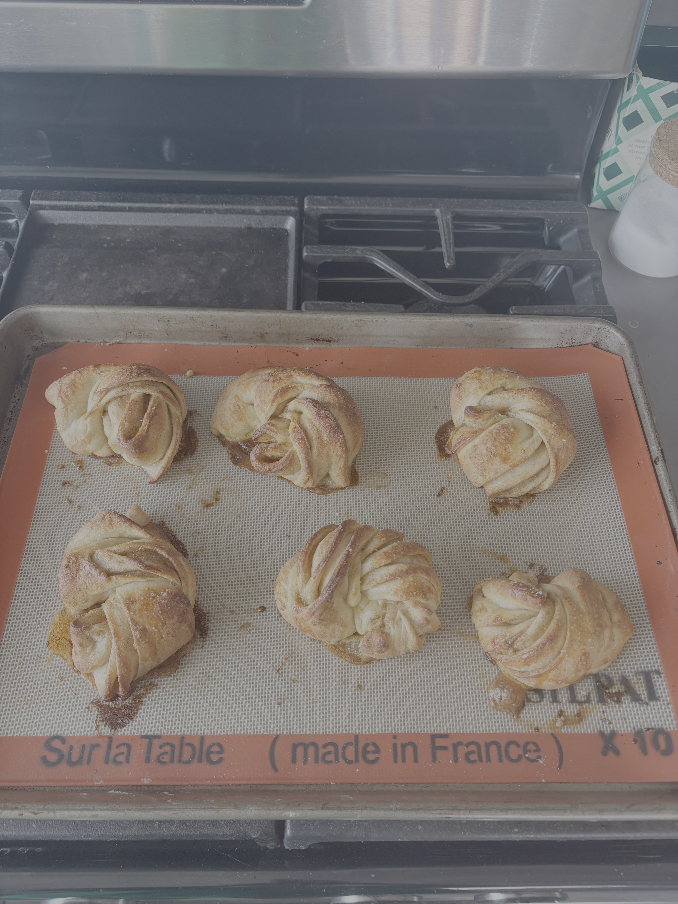
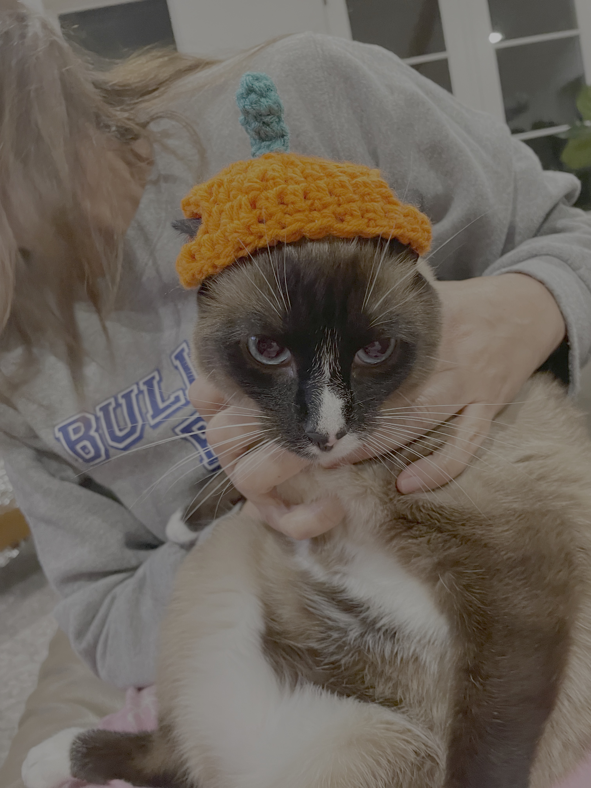
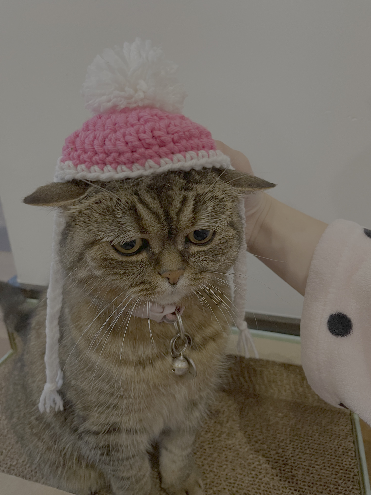
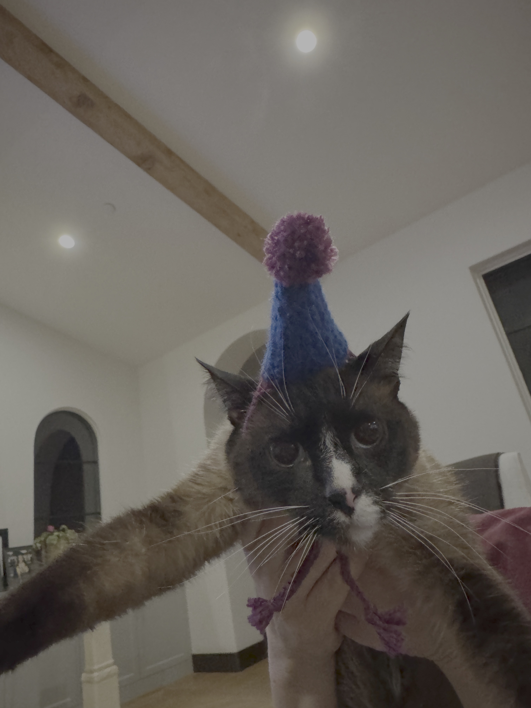

After a day of staring at a screen, I like to change it up with a hands-on activity.

## Baking

This past year I've been experimenting with yeast! I baked my first loaf of bread and tested out cinnamon rolls and cardamom buns. I'm building up courage to tackle sourdough next year.

::: {layout-ncol="3"}
{fig-align="left" width="300"}

{fig-align="center" width="300"}

{fig-align="center" width="300"}
:::

## Sewing

## Crochet

Cat hats are a quick project that require little time and produce a lot of joy (not their joy, as you can see).

::: {layout-ncol="3"}
{alt="One of my recent loaves" fig-align="left" width="300"}

{alt="Cinnamon rolls with extra cinnamon" fig-align="center" width="300"}

{alt="Cinnamon rolls with extra cinnamon" fig-align="right" width="300"}
:::
