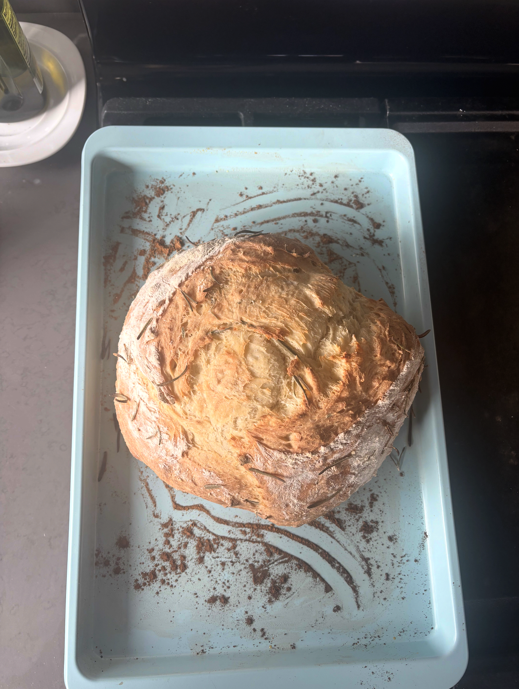
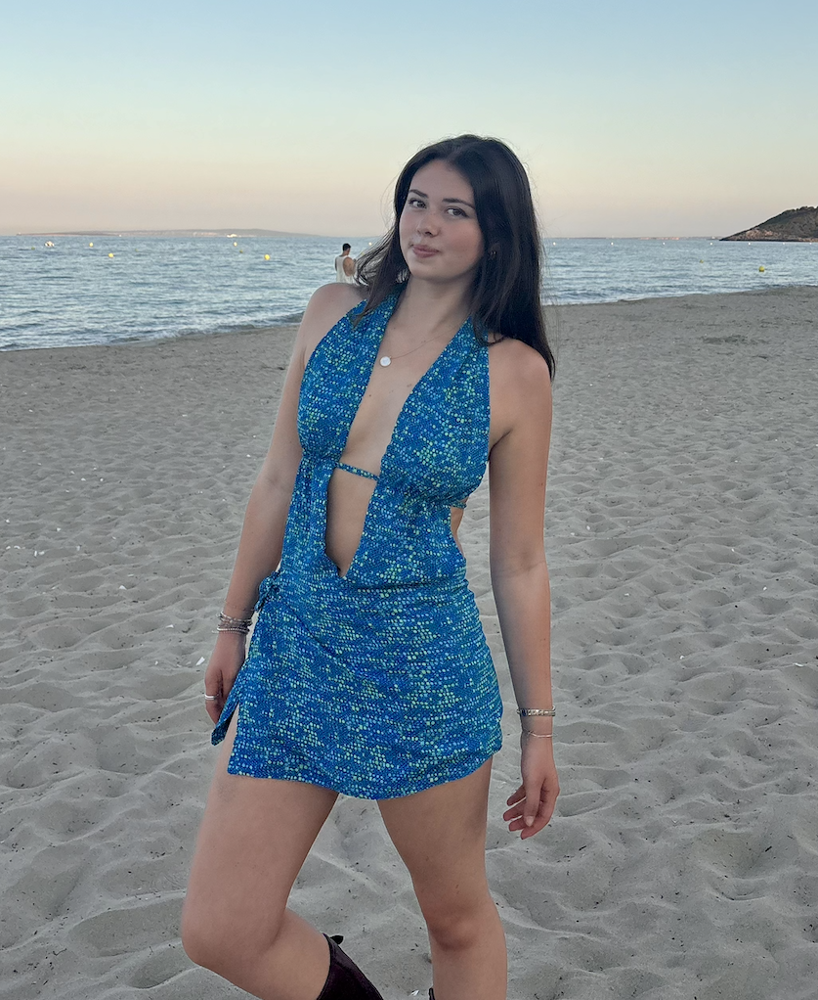
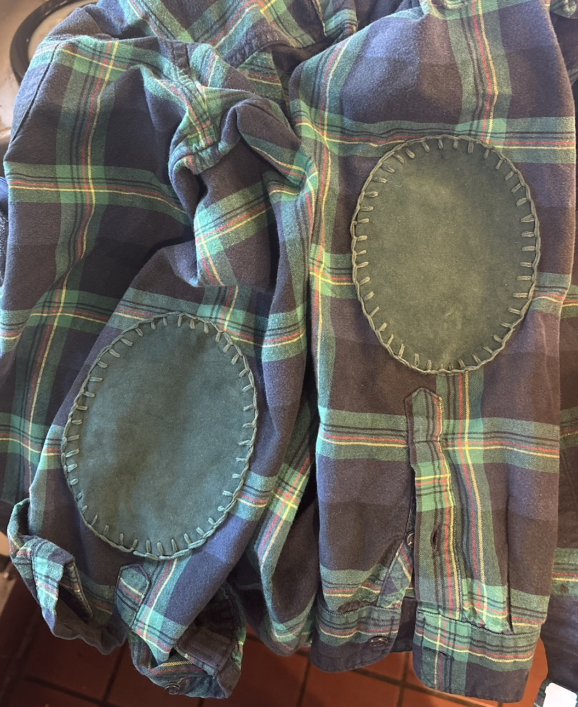
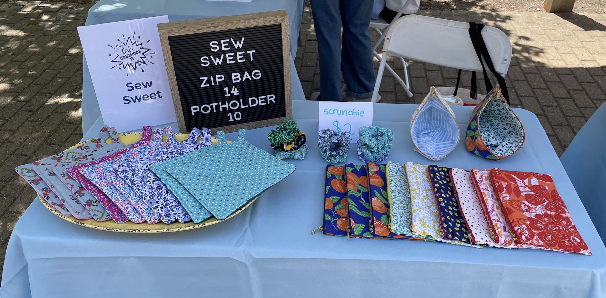
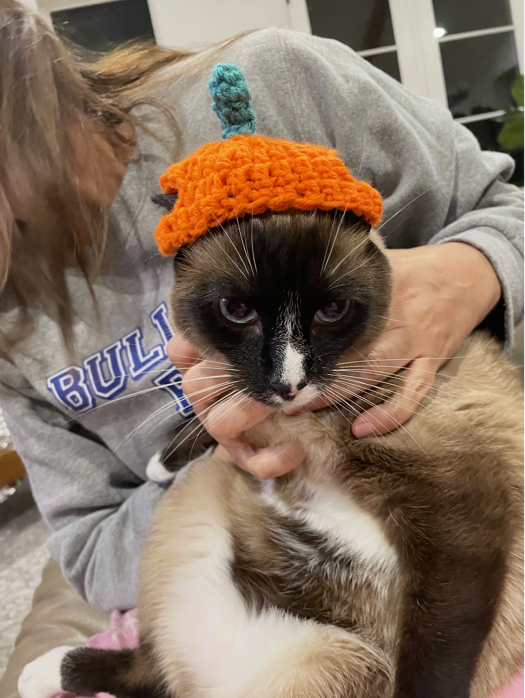
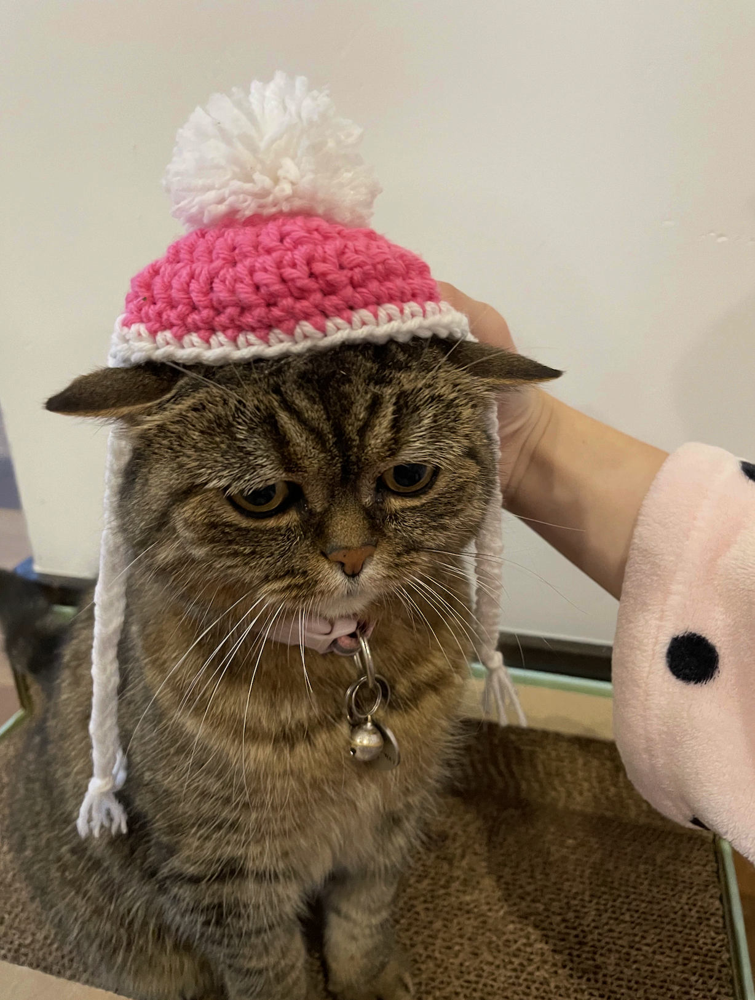
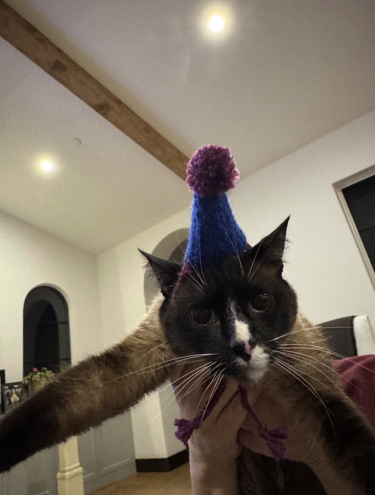

After a day of staring at a screen, I like to mix it up with a hands-on activity.

## Baking

This past year I've been experimenting with yeast! I baked my first loaf of bread and tested out cinnamon rolls and cardamom buns. I'm building up courage to tackle sourdough next year.

::: {layout-ncol="3"}
{fig-align="left" width="300"}

{fig-align="center" width="300"}

{fig-align="right" width="300"}
:::

## Sewing

A recent project I am proud of is the dress I made for my trip to Ibiza, Spain. I created the pattern from scratch and used secondhand fabric that was passed down to me. Occasionally I sew by hand, like when I used a blanket stitch to add elbow patches to my dad's favorite shirt.

::: {layout-ncol="2"}
{alt="One of my recent loaves" fig-align="left" width="400"}

{alt="Cinnamon rolls with extra cinnamon" fig-align="right" width="400"}
:::

In middle and high school, I was part of a local entrepreneurship program for young women. Here was one of my table spreads at a pop-up shop! I still enjoy making zip bags and potholders for friends and family as gifts.

{alt="One of my recent loaves" fig-align="center" width="600"}

## Crochet

Cat hats are a quick project that require little time and produce a lot of joy (not their joy, as you can see).

::: {layout-ncol="3"}
{alt="One of my recent loaves" fig-align="left" width="300"}

{alt="Cinnamon rolls with extra cinnamon" fig-align="center" width="300"}

{alt="Cinnamon rolls with extra cinnamon" fig-align="right" width="300"}
:::
